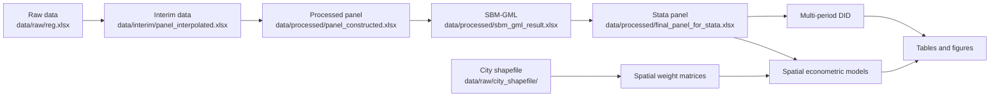

# Green Total Factor Productivity, Multi-period DID and Spatial Econometrics


本仓库是毕业论文实证部分的可复现研究代码包，围绕城市面板数据，完成数据清洗、变量构建、SBM-GML 绿色全要素生产率测算、多期 DID、空间相关性检验、空间杜宾模型、稳健性检验、异质性分析与中介机制检验。

## 论文摘要

本文基于城市层面面板数据，构建绿色全要素生产率指标，并结合多期 DID 与空间计量模型识别政策冲击对城市经济增长与绿色发展的影响。首先使用 Python 完成数据预处理、缺失值组内线性插补、资本存量测算和核心变量构建；随后基于包含非期望产出的 SBM-GML 框架测度绿色全要素生产率；最后使用 Stata 进行传统多期 DID、空间权重矩阵构建、Moran 指数检验、空间杜宾 DID 回归以及稳健性、异质性和中介机制分析。

## Workflow



## Repository Structure

```text
thesis-gtfp-did-research-pipeline/
├─ data/
│  ├─ raw/                  # 原始数据，包含 reg.xlsx 与 shapefile
│  ├─ interim/              # 插补、清洗后的中间数据
│  ├─ processed/            # 最终建模数据、SBM-GML 结果和空间矩阵
│  └─ external/             # 外部数据来源说明
├─ scripts/
│  ├─ python/               # 数据处理与 SBM-GML
│  └─ stata/                # DID、空间计量、稳健性等
├─ docs/                    # 公式说明、数据字典、简历项目说明
├─ figures/                 # 图片输出
├─ results/                 # 表格输出
├─ site/                    # 学术风格项目主页
└─ notebooks/               # 可选 EDA notebook
```

## Quick Start

### 1. 准备数据

请将原始面板数据放入：

```text
data/raw/reg.xlsx
```

若运行空间权重矩阵代码，请将城市行政区划 shapefile 完整放入：

```text
data/raw/city_shapefile/
```

至少需要：`.shp`、`.dbf`、`.shx`，建议同时保留 `.prj` 和 `.cpg`。

### 2. Python 环境

```bash
pip install -r requirements.txt
```

按顺序运行：

```bash
python scripts/python/01_raw_to_interim.py
python scripts/python/02_construct_variables.py
python scripts/python/03_sbm_gml.py
python scripts/python/04_export_for_stata.py
```

### 3. Stata 环境

建议安装：

```stata
ssc install reghdfe, replace
ssc install ftools, replace
ssc install estout, replace
ssc install coefplot, replace
ssc install winsor2, replace
ssc install xsmle, replace
ssc install spwmatrix, replace
```

按顺序运行：

```stata
do scripts/stata/01_setup.do
do scripts/stata/02_did_baseline.do
do scripts/stata/03_spatial_weights.do
do scripts/stata/04_spatial_models.do
do scripts/stata/05_robustness_heterogeneity_mediation.do
```

## Data Pipeline

| Stage                  | Input                       | Output                                   | Script                        |
| ---------------------- | --------------------------- | ---------------------------------------- | ----------------------------- |
| Raw to interim         | `data/raw/reg.xlsx`       | `data/interim/panel_interpolated.xlsx` | `01_raw_to_interim.py`      |
| Variable construction  | `panel_interpolated.xlsx` | `panel_constructed.xlsx`               | `02_construct_variables.py` |
| SBM-GML                | `panel_constructed.xlsx`  | `sbm_gml_result.xlsx`                  | `03_sbm_gml.py`             |
| Stata export           | `sbm_gml_result.xlsx`     | `final_panel_for_stata.xlsx`           | `04_export_for_stata.py`    |
| DID and spatial models | processed data              | tables/figures                           | Stata scripts                 |

## Notes

- 本仓库默认不上传真实原始数据，以避免版权、隐私和论文查重风险。
- 代码中的变量名称与论文附录保持一致；如原始数据列名不同，请在 Python 脚本中统一修改。

## Citation

如果引用本仓库，请参考 `CITATION.cff`。

## License

MIT License.
