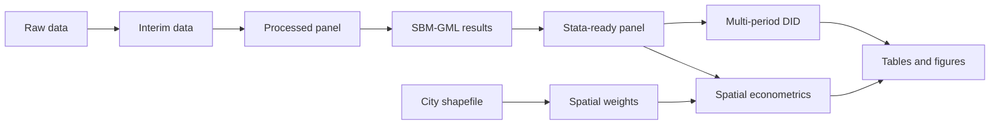

# Green Total Factor Productivity, Multi-period DID and Spatial Econometrics


This repository provides a reproducible research pipeline for an empirical thesis project on city-level panel data, green total factor productivity, multi-period difference-in-differences, and spatial econometric models.

## Abstract

This project constructs city-level variables, estimates green total factor productivity using an undesirable-output SBM-GML framework, and evaluates policy effects through multi-period DID and spatial econometric models. The workflow uses Python for data cleaning, interpolation, capital stock measurement, variable construction, and SBM-GML estimation, and Stata for DID regressions, spatial weight matrices, Moran's I, spatial Durbin models, robustness checks, heterogeneity analysis, and mediation analysis.

## Workflow



## Quick Start

Place the raw panel data at:

```text
data/raw/reg.xlsx
```

Place complete shapefile components at:

```text
data/raw/city_shapefile/
```

Install Python dependencies:

```bash
pip install -r requirements.txt
```

Run Python scripts:

```bash
python scripts/python/01_raw_to_interim.py
python scripts/python/02_construct_variables.py
python scripts/python/03_sbm_gml.py
python scripts/python/04_export_for_stata.py
```

Then run Stata scripts in order:

```stata
do scripts/stata/01_setup.do
do scripts/stata/02_did_baseline.do
do scripts/stata/03_spatial_weights.do
do scripts/stata/04_spatial_models.do
do scripts/stata/05_robustness_heterogeneity_mediation.do
```

## License

MIT License.
